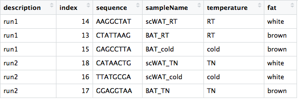

# Different approaches to running `bcbioSingleCell`

There are various approaches to running `bcbioSingleCell` to generate the QC report. The first part is getting all of the output from the **`bcbio` final directory loaded in to create the `bcb` object**. The next step is running through code which will **compute metrics and generate figures for quality assessment**. This second step is best done locally so you can run the code interactively and assess things as you run through the report code chunks. For approaches #1 and #2 listed below, you are doing everything locally. For #3 and #4 you are creating the `bcb` object on the cluster, and then moving it local to create the report. 

1. **Using a [Docker image](https://hub.docker.com/r/lpantano/bcbiosinglecell/)**. 
    - First, install Docker 
    - Pull the Docker image: `docker pull lpantano/bcbiosinglecell:r3.5-bsc0.1.5`
    - Set your memory RAM limit to 4G or more. This is done with the Docker main application (Preferences -> Advanced)
    - Mount the O2 `final` directory from your `bcbio` run on your laptop
    - Open up a terminal and make sure you are in your home directory (or a place where you can easily navigate to the mount space)
    - Run the Docker image: `docker run -d -p 8787:8787 -e ROOT=TRUE -v $(pwd):/home/rstudio lpantano/bcbiosinglecell`
    - In a browser connect to RStudio: localhost:8787 with user and password: rstudio/rstudio. From here you can start [Creating the metadata file](#metadata), and continue working within the Docker container to create the QC report.   
    
    ---
    
    > **NOTE:** If you start a Docker container and realize you want to start a new one, you will want to kill this one and remove it using the commands below:
    > ```
    > docker ps # to see your containers listed by id
    > docker stop <container_id>
    > docker rm <container_id> ```

2. Running it **locally on your laptop RStudio**. This will require you to install `bcbioSingleCell` and also mount O2. Note that if you have more 400K-500K cells this will max out of memory. Also, note you may have to deal with problems with various dependency packages as you update R. If you choose this method, skip down to [Creating the metadata file section](#metadata) and get started.

3. **Generate the `bcb` object on the O2 cluster**. You are limited to using R 3.4.1 because that is what is available for conda and the modules, but `bcbioSingleCell` is backwards compatible to R 3.4.1. The code is as follows:

```r
	bcbio <- loadSingleCell("~/bcbio/PIs/path/to/final/",
                        interestingGroups = "sampleName",
                        sampleMetadataFile = "~/path/to/metadata", 
                        gtfFile = "~/bcbio/PIs/path/to/Homo_sapiens.GRCh38.90.chr_patch_hapl_scaff.gtf")
	
	save(bcbio_output, file="data/bcb.rda")
```

The above code chunk can be run on O2 in one of two ways:

   - **A.** Using a **conda install of R 3.4.1** and pointing to a [shared R library](#rlib). For the conda recipe you can find more information [here](https://steinbaugh.com/r_bioconda). Keep note of the different versions when you create your environment (i.e. pandoc 1 is required for rmarkdown (version 2 is super buggy) and hdf5 1.10.1 is required for the latest version of Seurat, or it won’t compile)
	
   - **B.** Using the **R 3.4.1 module** and pointing to the [shared R library](#rlib). This may require some troubleshooting with the HMSRC folks as it has been known to be problematic.
	
		
> #### Using a pre-existing shared R library on O2 (for single cell RNA-seq) <a name="rlib"></a>
>  This library has been created for use with single cell RNA-seq analysis. It can be used not only for QC but also for clustering with Seurat. First, you will need to edit your `.Renviron` file to have the following inside:
> 
> ```
> R_LIBS_USER="/n/data1/cores/bcbio/R/library/3.4-bioc-release/library"
> R_MAX_NUM_DLLS=150
> ```
> 
> Then start an interactive session with extra memory and x11:
> 
> `$ srun --pty -p interactive -t 0-12:00 --x11 --mem 128G /bin/bash`
> 
> After starting the interactive session, load the necessary R modules and start R as described at https://github.com/hbc/knowledgebase/blob/master/research/scrnaseq/Single-Cell.md#shared-installation-in-o2.


### Creating the metadata file <a name="metadata"></a>

Use the information from the client to construct the metadata table to use with bcbioSingleCell R package according to the specifications detailed at [https://github.com/hbc/bcbioSingleCell](https://github.com/hbc/bcbioSingleCell). You will need the columns for `description`, `index`, `sequence`, and `sampleName`. You can add any additional metadata as desired.

- **Example metadata table:**
	
	
	
	- **Important:** the `sequence` column for the inDrop metadata is the **Forward** sequence, not the same as the sequences present in the `sample_barcodes` file, which is the reverse complement. 
